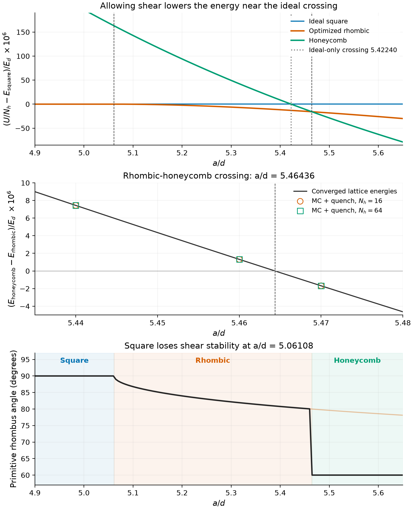
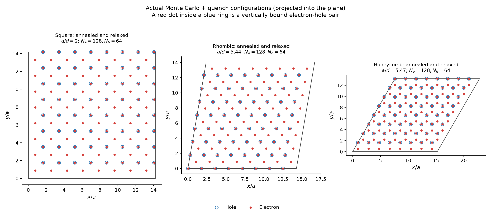
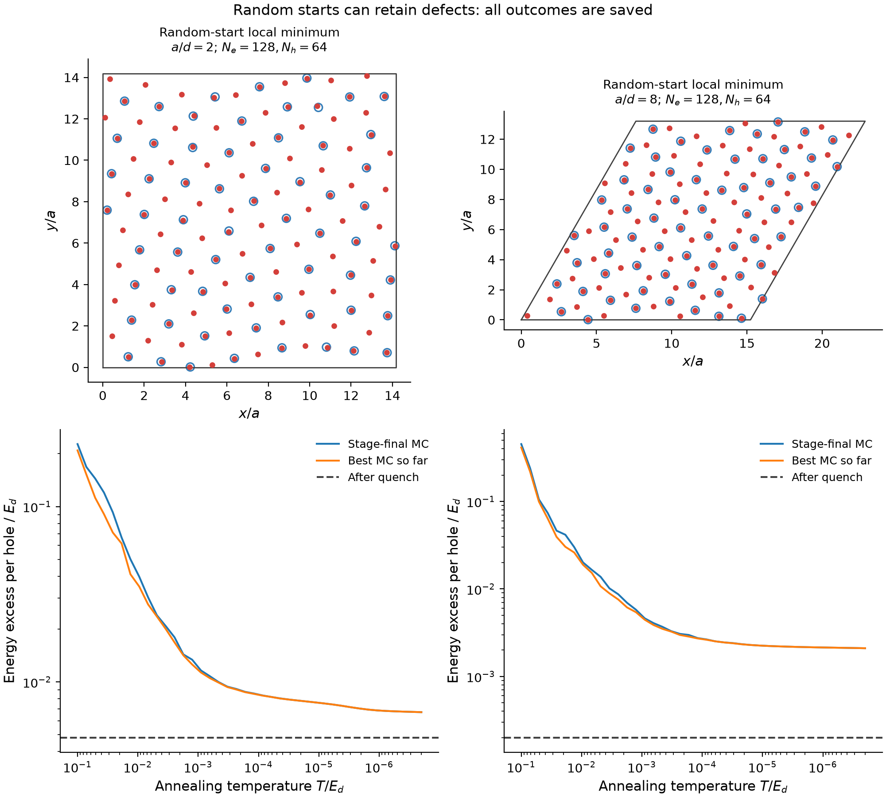
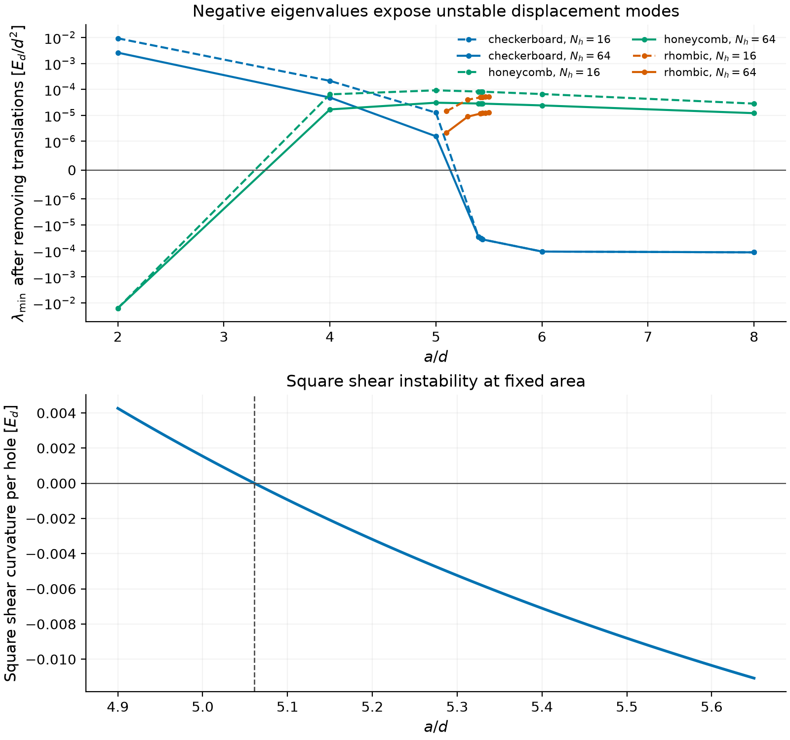

# Classical Monte Carlo comparison and stability result

## Result

**The ideal checkerboard-honeycomb crossing is reproduced at a/d = 5.42240068.**
However, the square checkerboard is unstable to shear before reaching it.
An optimized rhombic crystal is lower in energy nearby. The lowest tested
sequence is:

| Candidate ground-state boundary | a/d | Interpretation |
|---|---:|---|
| Square to rhombic | **5.06108** | Continuous onset of shear; angle departs from 90 degrees |
| Rhombic to honeycomb | **5.46436** | Energy crossing; angle jumps from about 79.99 to 60 degrees |
| Ideal square vs ideal honeycomb only | 5.42240068 | Restricted comparison reproducing the paper's 5.42 |

The rhombic-to-honeycomb crossing is bracketed directly by the relaxed
Monte Carlo energies at **5.46 and 5.47**, for both 48 and 192 individual
charges. Linear interpolation gives 5.464381
(Nh=16) and 5.464381 (Nh=64).
The more precise value above comes from converged periodic lattice energies;
it is not a statistical Monte Carlo confidence interval.

## Why the extra branch matters

At a/d=5.44, the rhombic angle is about 80.2742 degrees.
Its energy per hole is **-1.323305531888 E_d**, which is **7.43682850e-06 E_d
lower than ideal honeycomb**. This is an explicit counterexample to using
the crossing of only the two ideal crystals as the unrestricted ground-state
boundary. The maximum discrepancy between the primary and independently
split electrostatic energies is 4.219e-15 E_d.

The density convention is **a=1/sqrt(pi*n_h), n_e=2*n_h**. Units are
**d=1, E_d=e^2/(4*pi*epsilon*d)**. Every energy below is **U/Nh**, not U/(Ne+Nh).

| a/d | Ideal square | Optimized rhombic | Honeycomb | Rhombic angle |
|---|---|---|---|---|
| 5.00 | -1.361888362189 | -1.361888362189 | -1.361691915534 | 90.0000 deg |
| 5.40 | -1.326485144870 | -1.326496721593 | -1.326476497889 | 80.7652 deg |
| 5.42 | -1.324881107918 | -1.324893928332 | -1.324880189468 | 80.5155 deg |
| 5.44 | -1.323291421606 | -1.323305531888 | -1.323298095059 | 80.2742 deg |
| 5.46 | -1.321715904127 | -1.321731348294 | -1.321730035443 | 80.0404 deg |
| 5.47 | -1.320933402695 | -1.320949529656 | -1.320951213468 | 79.9263 deg |
| 5.50 | -1.318606663148 | -1.318624898854 | -1.318635318120 | 79.5942 deg |

## Monte Carlo evidence

Completed **121 particle annealing runs**, including **20
uniform-random starts**, with **39,782,400 attempted particle/pair moves**.
The runs use Ne=2Nh and Nh=16 or 64. Every electron and hole moves independently;
paired proposals improve efficiency without enforcing binding.
The best visited and final MC states are separately quenched to zero temperature.

The table uses the lowest relaxed run for each indicated initial branch,
density, and size. Other runs, including defective outcomes, remain in the
saved dataset. The added boundary suite uses a lower starting temperature
than the broad exploratory suite; details are in [METHODS.md](METHODS.md).

| a/d | Nh | MC+quench rhombic | MC+quench honeycomb | Honeycomb - rhombic |
|---|---|---|---|---|
| 5.44 | 16 | -1.323305531888 | -1.323298095059 | +7.436828e-06 |
| 5.46 | 16 | -1.321731348294 | -1.321730035443 | +1.312851e-06 |
| 5.47 | 16 | -1.320949529656 | -1.320951213468 | -1.683813e-06 |
| 5.44 | 64 | -1.323305531886 | -1.323298095058 | +7.436828e-06 |
| 5.46 | 64 | -1.321731348294 | -1.321730035443 | +1.312851e-06 |
| 5.47 | 64 | -1.320949529655 | -1.320951213468 | -1.683814e-06 |

There are also **15 independently initialized cell-shape basin-hopping
searches, totaling 1,200 quenched Metropolis proposals**. They vary both the
cell shape and all independent primitive-cell particle coordinates. Their
lowest energies agree with the extended square/rhombic/honeycomb envelope;
see `results/cell_mc_summary.csv` and the saved proposal histories. The
quenched visitation counts describe this optimizer and have no interpretation
as physical equilibrium phase probabilities.

## Configuration stability

The Hessian is the curvature of energy with respect to in-plane particle
displacements. Two uniform translation modes are projected out explicitly.
Negative eigenvalues indicate an instability, even when all forces vanish.
Eigenvalue units are E_d/d^2.

| Structure | a/d | Lowest non-translation eigenvalue | Negative modes |
|---|---|---|---|
| checkerboard | 2.0 | +2.592842e-03 | 0 |
| honeycomb | 2.0 | -1.593600e-02 | 63 |
| checkerboard | 5.4224 | -3.251251e-05 | 14 |
| honeycomb | 5.4224 | +2.841617e-05 | 0 |
| checkerboard | 8.0 | -1.129433e-04 | 14 |
| honeycomb | 8.0 | +1.212758e-05 | 0 |

The optimized rhombic branch has **zero negative modes** in the tested 4x4
and 8x8 supercells at a/d=5.1, 5.3, 5.42, 5.44, the new crossing, and 5.5.
It remains locally stable slightly above its energy crossing, where honeycomb
has the lower energy. The square has negative homogeneous shear curvature
above about 5.06108 and negative finite-cell displacement modes near 5.42.

## Verification and numerical precision

All checks in `verify.py` and `verify_alternative.py` passed. Key results:

- Analytic Fourier kernel vs independent quadrature: 2.665e-15.
- Analytic force vs finite-difference energy gradient: 1.787e-09.
- Ewald splitting variation on a distorted random configuration: 5.329e-15 E_d.
- Largest saved/recomputed MC-quench energy discrepancy: 0.000e+00 E_d per hole.
- Largest residual Cartesian force among all relaxed particle runs: 4.119e-07 E_d/d.
- 26 particle runs reached energies below the two-ideal-structure envelope;
  no saved state was below the expanded square/rhombic/honeycomb envelope by more than 1e-8 E_d per hole.
- Changing Ewald splitting and cutoffs shifts the rhombic/honeycomb root by less than 2e-9 in a/d.
- The square shear root converges to about 5.061078 as the finite-difference strain step is reduced.

Five decimal places are reported for the new candidate boundaries. Extra
digits in the JSON files record numerical convergence, not proof that other
untested structures cannot alter the phase diagram.

## Relation to the paper and limits

The supplied paper (p. 2 and Fig. 1) reports a/d=5.42 after comparing the two
identified ideal composite geometries. Supplement section I describes
random-position classical minimization and Ewald summation. This benchmark
reproduces that restricted energy comparison, but free particle stability
and cell-shape relaxation expose an additional rhombic minimum. The energy
counterexample is confirmed by a separate electrostatic representation.

These calculations support the expanded **candidate** ground-state sequence
for this classical Hamiltonian. Finite cells sample only commensurate
wavevectors, particle runs have fixed boxes, and cell-shape searches use a
three-charge primitive cell. A finite search cannot exclude every larger
basis, longer wavelength modulation, or other competing phase. No
finite-temperature free energy or quantum phase boundary is inferred.

## Files and reproduction

- [README.md](README.md): commands and file map.
- [METHODS.md](METHODS.md): equations, conventions, schedules, and measurements.
- `results/extended_transitions.json`: both expanded boundaries and convergence.
- `results/mc_runs.csv`: every particle run and its measured final order.
- `results/runs/`: all initial, final, best, and relaxed coordinates and histories.
- `results/verification.json`, `results/alternative_verification.json`: executable checks.
- `sources/paper.pdf`, `sources/supp.pdf`: supplied sources.

Source: [Dai and Fu, Physical Review Letters 132, 196202 (2024)](https://doi.org/10.1103/PhysRevLett.132.196202),
main paper pp. 2-3 and Supplementary Material section I, pp. 1-2.
